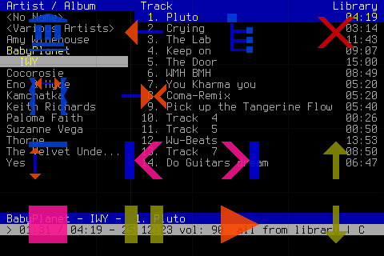

# Tosh - Touch on Shell

#### **Touch operation for nearly every command line app on Raspberry Pi with Touch-LCD**

Transparent overlay dashboard, one tap hide and show, highly configurable, low cpu load ...

Example configured as mp3 player, featuring [> cmus <](https://cmus.github.io/)

Tosh Demo  
[https://youtu.be/OJ_YkjgRMck](https://youtu.be/OJ_YkjgRMck)

- - -

**preparation**
- for proper configured LCD and Touch  
  [LCD and Touch](instruct/lcd_touch.md)

**installation**

- download repository from GitHub,  
  unzip and copy to Raspberry Pi  
  (for example to: ~/tosh)  
  **or**  
  [Clone repository](#clone-repository)
- change directory  
  `cd ~/tosh`
- compile with  
  `$ make`
- run with  
  `$ sudo ./tosh`

**expample**

- [Tosh with cmus](instruct/cmus.md)

- - -

#### Clone repository

check if git installed  
`$ git --version`

if git is not installed  
`$ sudo apt-get install git-all`

clone Tosh repository  
`$ git clone https://github.com/qrti/tosh.git`

- - -

#### Features

- transparent graphical overlay
- one tap hide and show
- works with a wide variety of command line apps
- highly configurable
- resolution independent
- low cpu load

- - -

#### Tested with

 - Raspbian Jessie Lite
 - Raspbian Jessie Full Desktop
 - Raspberry Pi 3
 - Raspberry Pi 2 B
 - Raspberry Pi B+
 - SainSmart LCD 480 x 320
 - WaveShare LCD 480 x 320
 - should work well with other displays and resolutions

- - -

#### Version History

0.90 initial  
0.91 bug fixes

- - -

#### Donations

Donations are welcome!

- - -

#### Copyright
Tosh is published under the terms of BSD license

Copyright (c) 2016, [qrt@qland.de](mailto:qrt@qland.de)  
All rights reserved.

Redistribution and use in source and binary forms, with or without modification, are permitted provided that the following conditions are met:

1. Redistributions of source code must retain the above copyright notice, this list of conditions and the following disclaimer.

2. Redistributions in binary form must reproduce the above copyright notice, this list of conditions and the following disclaimer in the documentation and/or other materials provided with the distribution.

THIS SOFTWARE IS PROVIDED BY THE COPYRIGHT HOLDERS AND CONTRIBUTORS "AS IS" AND ANY EXPRESS OR IMPLIED WARRANTIES, INCLUDING, BUT NOT LIMITED TO, THE IMPLIED WARRANTIES OF MERCHANTABILITY AND FITNESS FOR A PARTICULAR PURPOSE ARE DISCLAIMED. IN NO EVENT SHALL THE COPYRIGHT HOLDER OR CONTRIBUTORS BE LIABLE FOR ANY DIRECT, INDIRECT, INCIDENTAL, SPECIAL, EXEMPLARY, OR CONSEQUENTIAL DAMAGES (INCLUDING, BUT NOT LIMITED TO, PROCUREMENT OF SUBSTITUTE GOODS OR SERVICES; LOSS OF USE, DATA, OR PROFITS; OR BUSINESS INTERRUPTION) HOWEVER CAUSED AND ON ANY THEORY OF LIABILITY, WHETHER IN CONTRACT, STRICT LIABILITY, OR TORT (INCLUDING NEGLIGENCE OR OTHERWISE) ARISING IN ANY WAY OUT OF THE USE OF THIS SOFTWARE, EVEN IF ADVISED OF THE POSSIBILITY OF SUCH DAMAGE.
