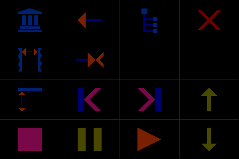
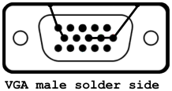

# Tosh - Touch on Shell


#### **Adds touch screen abilities on shell level for Raspberry Pi**

Overlay dashboard for console applications, low cpu load, highly configurable ...


Example configured as mp3 player, featuring [> cmus <](https://cmus.github.io/)

Tosh Demo  
[https://youtu.be/OJ_YkjgRMck](https://youtu.be/OJ_YkjgRMck)

- - -

**preparation**
- for proper configured LCD and Touch  
  [LCD and Touch](#lcd-and-touch)
- optionally  
  [Install cmus](#install-cmus)

**installation**

- download repository from GitHub,  
  unzip and copy to Raspberry Pi  
  (for example to: ~/tosh)  
  or  
  [Install git directly](#install-git-directly)
- change directory  
  `cd ~/tosh`
- compile with  
  `$ make`
- run with  
  `$ sudo ./tosh`

**expansion**

- for own dashboard configurations  
  [Dashboard Configuration](#dashboard-configuration)

- - -

#### Install git directly

check if git installed  
`$ git --version`

if git is not installed  
`$ sudo apt-get install git-all`

clone Tosh repository  
`$ git clone https://github.com/qrti/tosh.git`

- - -

#### Dashboard Configuration

dashboard configuration is done in [config.ini](source/config.ini), grid size, tiles, shapes, colors, commands, start app, command line and some flags can be set, instructions are given in the comments of the file

**symbols and functions** (used in config.ini)



|function    |function     |function    |function     |touch          |
|------------|-------------|------------|-------------|---------------|
|library<br>-|copy<br>-    |file<br>-   |hide<br>quit |*short<br>long*|
|window<br>- |remove<br>-  |-<br>-      |-<br>-       |*short<br>long*|
|expand<br>- |prev<br>back+|next<br>fwd+|up<br>up+    |*short<br>long*|
|stop<br>-   |pause<br>-   |play<br>-   |down<br>down+|*short<br>long*|
\+ repeat

**functions and keys**

|function                 |key   |
|-------------------------|------|
|library view             |1     |
|copy from file to library|a     |
|quit                     |qy    |
|file view                |5     |
|window change            |tab   |
|remove from library      |D     |
|expand library entry     |space |
|previous track           |z     |
|back seek                |h     |
|next track               |b     |
|forward seek             |l     |
|up entry                 |k     |
|down entry               |j     |
|stop                     |v     |
|pause                    |c     |
|play / choose entry      |return|

complete list of [cmus functions and keys](https://github.com/cmus/cmus/blob/master/Doc/cmus.txt)

- - -

#### Install cmus

install cmus without recommends to prevent possible dnet-common and libdnet trouble  
`$ sudo aptitude -R install cmus`

if you need ffmpeg  
`$ sudo aptitude install cmus-plugin-ffmpeg`  
or  
install cmus comletely  
`$ sudo apt-get install cmus`

if your run into trouble with dnet-common and libdnet  
`$ sudo apt-get purge libdnet dnet-common`

- - - 

#### Tips for cmus

to auto resume cmus  
`$ nano ~/.cmus/rc`
```
set resume=true
```

to auto login your Raspberry Pi  
`$ sudo raspi-config`  
*Boot Options / Console Autologin*

autostart Tosh after login  
`$ nano ~/.bashrc`
```
cd ~/tosh  
sudo ./tosh
```

audio output consideration
- built in audio output  
  already there no extra costs, no need for  
  additional drivers, very poor sound quality,  
  maybe good enough for load music, definitely  
  a no go for classical music  
- USB Sound sticks  
  low price, needs drivers, medium sound quality  
- sound card  
  high price, needs drivers, reserves connectors,  
  blocks other extension cards (LCD etc.),  
  high sound quality b
- HDMI sound splitter or HDMI to VGA adapter with sound splitter  
  mid price, no need for additional drivers,  
  medium sound quality

in this project HDMI output isn't used because of the LCD-Touch panel, so a HDMI to VGA adapter with sound splitter was connected, to make it work properly a VGA plug has to be put on the adapters VGA socket, the ground pins of the plug must be wired to the plugs housing to fake a cable



- - -

#### LCD and Touch

if your LCD does not run on Raspbian yet, follow the steps given at  
[LCD and Touch Config](#lcd-and-touch-config)

so far LCD and touch should work on consoles now and Tosh should run properly, anyway sometimes it is necessary to swap and/or invert touch axis for some systems

- axis swap is done in /boot/config.txt  
  see [LCD and Touch Config](#lcd-and-touch-config)
- axis inversion is done in section [TOUCHCON]  
  of tosh [config.ini](source/config.ini)

for sake of completeness, LCD and touch for Raspian desktop systems need two more steps to make X11 work correct

- touch axis inversion
- touch calibration

find detailed descriptions at  
[http://www.circuitbasics.com/raspberry-pi-touchscreen-calibration-screen-rotation/](http://www.circuitbasics.com/raspberry-pi-touchscreen-calibration-screen-rotation/)

- - -

#### LCD and Touch Config

steps for installing LCD and touch on Raspian *Jessie*

install current updates  
`$ sudo apt-get update`  
`$ sudo apt-get upgrade`  
`$ sudo apt-get clean`  

(for Raspian Jessie *Lite*)  
in order to do a firmware update that covers LCD framebuffer support, add rpi update script, current Raspbian versions with built in framebuffer support may make this step unnecessary  
`$ sudo apt-get update`  
`$ sudo apt-get install git`  
`$ sudo wget https://raw.github.com/Hexxeh/rpi-update/master/rpi-update -O /usr/bin/rpi-update && sudo chmod +x /usr/bin/rpi-update`

(for Raspian Jessie *Lite*)  
now that we have the script, update the firmware and reboot  
`$ sudo rpi-update`  
`$ sudo reboot`  

be sure SPI is enabled  
`$ sudo raspi-config`  
*advanced options/spi - enabled yes*  
or  
`$ sudo nano /boot/config.txt`
```
dtparam=spi=on
```

the following settings are for SainSmart and WaveShare 480 x 320 displays, depending on your device values may differ

first check the modules.conf, it should look something like this  
`$ sudo nano /etc/modules-load.d/modules.conf`
```
snd-bcm2835  
i2c-bcm2708  
i2c-dev  
spi_bcm2835  
flexfb  
fbtft_device
```

these next values will configure the display to landscape mode, Raspberry Pi board power plug on top side

check flexfb.conf  
`$ sudo nano /etc/modprobe.d/flexfb.conf`
```
options flexfb width=480 height=320 regwidth=16 init=-1,0xb0,0x0,-1,0x11,-2,250,-1,0x3A,0x55,-1,0xC2,0x44,-1,0xC5,0x00,0x00,0x00,0x00,-1,0xE0,0x0F,0x1F,0x1C,0x0C,0x0F,0x08,0x48,0x98,0x37,0x0A,0x13,0x04,0x11,0x0D,0x00,-1,0xE1,0x0F,0x32,0x2E,0x0B,0x0D,0x05,0x47,0x75,0x37,0x06,0x10,0x03,0x24,0x20,0x00,-1,0xE2,0x0F,0x32,0x2E,0x0B,0x0D,0x05,0x47,0x75,0x37,0x06,0x10,0x03,0x24,0x20,0x00,-1,0x36,0x28,-1,0x11,-1,0x29,-3

# for 180 degree lcd rotation use this line instead (waveshare display)
# touch settings in /boot/config.txt and /etc/X11/xinit/xinitrc have to be adapted
#options flexfb width=480 height=320 regwidth=16 init=-1,0xb0,0x0,-1,0x11,-2,250,-1,0x3A,0x55,-1,0xC2,0x44,-1,0xC5,0x00,0x00,0x00,0x00,-1,0xE0,0x0F,0x1F,0x1C,0x0C,0x0F,0x08,0x48,0x98,0x37,0x0A,0x13,0x04,0x11,0x0D,0x00,-1,0xE1,0x0F,0x32,0x2E,0x0B,0x0D,0x05,0x47,0x75,0x37,0x06,0x10,0x03,0x24,0x20,0x00,-1,0xE2,0x0F,0x32,0x2E,0x0B,0x0D,0x05,0x47,0x75,0x37,0x06,0x10,0x03,0x24,0x20,0x00,-1,0x36,0xe8,-1,0x11,-1,0x29,-3

options fbtft_device debug=3 rotate=0 name=flexfb speed=16000000 gpios=reset:25,dc:24

# seems to be ignored, equivalent settings now in /boot/config.txt
#options ads7846_device model=7846 cs=1 gpio_pendown=17 keep_vref_on=1 swap_xy=1 pressure_max=255 x_plate_ohms=60 x_min=200 x_max=3900 y_min=200 y_max=3900

```

now check cmdline.txt  
`$ sudo nano /boot/cmdline.txt`
```
dwc_otg.lpm_enable=0 console=tty1 console=ttyAMA0,115200 root=/dev/mmcblk0p2 rootfstype=ext4 elevator=deadline rootwait fbcon=map:11 fbcon=font:ProFont6x11 fsck.repair=yes fbtft_device.rotate=0 root wait
```

also be sure that your touchscreen is set as input device and swapxy is set correctly, edit the following line if necessary,  
reboot after this last step  
`$ sudo nano /boot/config.txt`
```
dtoverlay=ads7846,speed=500000,penirq=17,swapxy=1
```
`$ sudo reboot`

to check your input devices enter  
`$ cat /proc/bus/input/devices`

the output looks much better if you slim the console font  
`$ sudo dpkg-reconfigure console-setup`  
*UTF-8 / Guess optimal character set / Terminus / 8 x 14*  
or  
`$ sudo nano /etc/default/console-setup`
```
CODESET="guess"  
FONTFACE="Terminus"  
FONTSIZE="8x14"
```

restart console to see changes  
`$ sudo /etc/init.d/console-setup restart`

- - -

#### Features

- highly configurable
- works with a wide variety of programs
- graphical overlay lcd resolution independent
- low cpu load

- - -

#### Tested with

 - Raspbian Jessie Lite
 - Raspbian Jessie Full Desktop
 - Raspberry Pi 3
 - Raspberry Pi 2 B
 - Raspberry Pi B+
 - SainSmart LCD 480 x 320
 - WaveShare LCD 480 x 320

- - -

#### Version History

0.90 initial  
0.91 bug fixes

- - -

#### Donations

Donations are welcome!

[](https://www.paypal.com/cgi-bin/webscr?cmd=_s-xclick&hosted_button_id=E7JNEDMHAJ3TJ)

- - -

#### Copyright
Tosh is published under the terms of BSD license

Copyright (c) 2016, [qrt@qland.de](mailto:qrt@qland.de)  
All rights reserved.

Redistribution and use in source and binary forms, with or without modification, are permitted provided that the following conditions are met:

1. Redistributions of source code must retain the above copyright notice, this list of conditions and the following disclaimer.

2. Redistributions in binary form must reproduce the above copyright notice, this list of conditions and the following disclaimer in the documentation and/or other materials provided with the distribution.

THIS SOFTWARE IS PROVIDED BY THE COPYRIGHT HOLDERS AND CONTRIBUTORS "AS IS" AND ANY EXPRESS OR IMPLIED WARRANTIES, INCLUDING, BUT NOT LIMITED TO, THE IMPLIED WARRANTIES OF MERCHANTABILITY AND FITNESS FOR A PARTICULAR PURPOSE ARE DISCLAIMED. IN NO EVENT SHALL THE COPYRIGHT HOLDER OR CONTRIBUTORS BE LIABLE FOR ANY DIRECT, INDIRECT, INCIDENTAL, SPECIAL, EXEMPLARY, OR CONSEQUENTIAL DAMAGES (INCLUDING, BUT NOT LIMITED TO, PROCUREMENT OF SUBSTITUTE GOODS OR SERVICES; LOSS OF USE, DATA, OR PROFITS; OR BUSINESS INTERRUPTION) HOWEVER CAUSED AND ON ANY THEORY OF LIABILITY, WHETHER IN CONTRACT, STRICT LIABILITY, OR TORT (INCLUDING NEGLIGENCE OR OTHERWISE) ARISING IN ANY WAY OUT OF THE USE OF THIS SOFTWARE, EVEN IF ADVISED OF THE POSSIBILITY OF SUCH DAMAGE.
