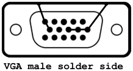
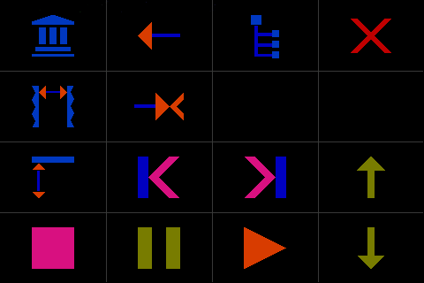

#### Install cmus

as an example for using Tosh, the following steps will install cmus mp3 player

install cmus without recommends to prevent possible dnet-common and libdnet trouble  
`$ sudo aptitude -R install cmus`

if you need ffmpeg  
`$ sudo aptitude install cmus-plugin-ffmpeg`  
or  
install cmus comletely  
`$ sudo apt-get install cmus`

if your run into trouble with dnet-common and libdnet  
`$ sudo apt-get purge libdnet dnet-common`

- - - 

#### Tips for cmus

to auto resume cmus  
`$ nano ~/.cmus/rc`
```
set resume=true
```

to auto login your Raspberry Pi  
`$ sudo raspi-config`  
*Boot Options / Console Autologin*

autostart Tosh after login  
`$ nano ~/.bashrc`
```
cd ~/tosh  
sudo ./tosh
```

audio output consideration
- built in audio output  
  already there no extra costs, no need for  
  additional drivers, very poor sound quality,  
  maybe good enough for load music, definitely  
  a no go for classical music  
- USB Sound sticks  
  low price, needs drivers, medium sound quality  
- sound card  
  high price, needs drivers, reserves connectors,  
  blocks other extension cards (LCD etc.),  
  high sound quality b
- HDMI sound splitter or HDMI to VGA adapter with sound splitter  
  mid price, no need for additional drivers,  
  medium sound quality

in this project HDMI output isn't used because of the LCD-Touch panel, so a HDMI to VGA adapter with sound splitter was connected, to make it work properly a VGA plug has to be put on the adapters VGA socket, the ground pins of the plug must be wired to the plugs housing to fake a cable



- - -

#### Dashboard Configuration

Tosh dashboard configuration is done in [config.ini](../source/config.ini), grid size, tiles, shapes, colors, commands, start app, command line and some flags can be set, instructions are given in the comments of the file

**symbols and functions** (used in config.ini)



|function    |function     |function    |function     |touch          |
|------------|-------------|------------|-------------|---------------|
|library<br>-|copy<br>-    |file<br>-   |hide<br>quit |*short<br>long*|
|window<br>- |remove<br>-  |-<br>-      |-<br>-       |*short<br>long*|
|expand<br>- |prev<br>back+|next<br>fwd+|up<br>up+    |*short<br>long*|
|stop<br>-   |pause<br>-   |play<br>-   |down<br>down+|*short<br>long*|
\+ repeat

**functions and keys**

|function                 |key   |
|-------------------------|------|
|library view             |1     |
|copy from file to library|a     |
|quit                     |qy    |
|file view                |5     |
|window change            |tab   |
|remove from library      |D     |
|expand library entry     |space |
|previous track           |z     |
|back seek                |h     |
|next track               |b     |
|forward seek             |l     |
|up entry                 |k     |
|down entry               |j     |
|stop                     |v     |
|pause                    |c     |
|play / choose entry      |return|

complete list of [cmus functions and keys](https://github.com/cmus/cmus/blob/master/Doc/cmus.txt)

- - -

[back to readme](../README.md)
